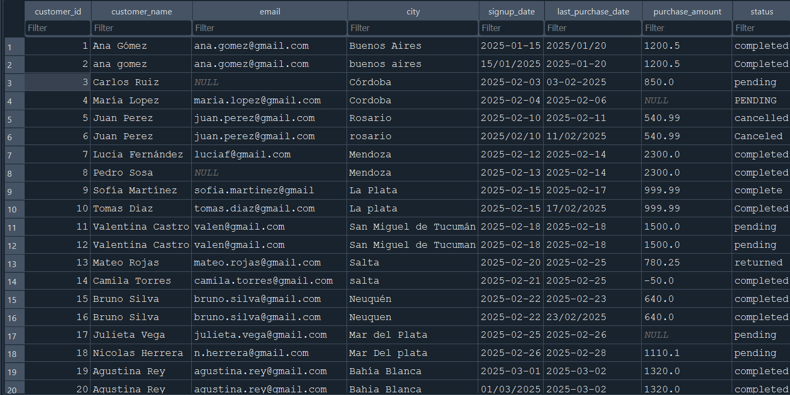
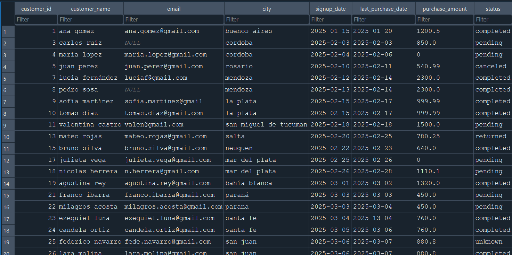
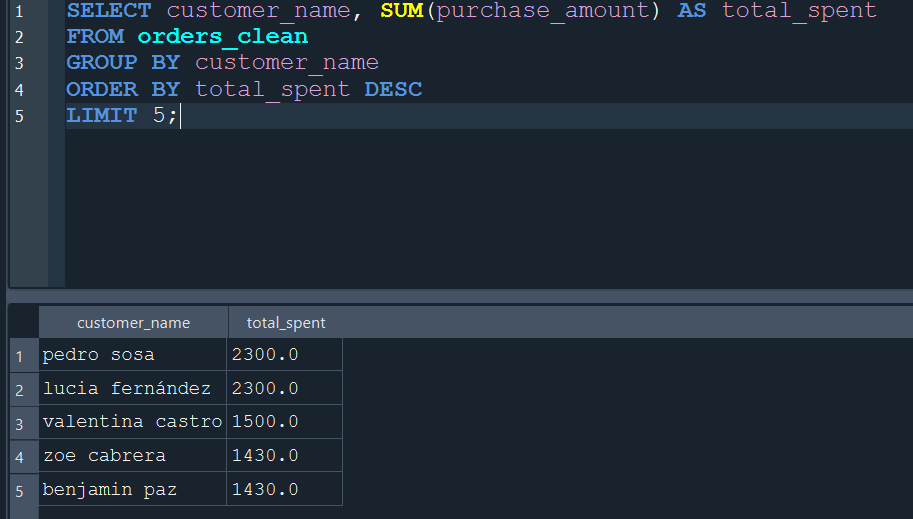

# Limpieza y Análisis de Datos con SQL

Proyecto de portafolio enfocado en la **limpieza, validación y análisis** exploratorio de un **dataset** de órdenes de clientes utilizando **SQL**.

El objetivo del proyecto es demostrar un flujo completo de trabajo en análisis de datos, desde la exploración inicial del dataset hasta la obtención de insights a partir de datos limpios.

---

# Business Problem

En muchos entornos empresariales los datos operativos contienen errores que afectan la calidad del análisis.  
Registros duplicados, valores nulos, inconsistencias en categorías y formatos de fecha incorrectos son problemas comunes que pueden generar conclusiones erróneas.

En este proyecto se simula un escenario real donde una empresa necesita **mejorar la calidad de su base de datos de órdenes de clientes** antes de realizar análisis de negocio.

El objetivo es identificar problemas de calidad en el dataset y aplicar un proceso estructurado de **data cleaning utilizando SQL**, generando un dataset confiable para análisis posteriores.

---

# Dataset

El dataset utilizado representa un conjunto de **órdenes de clientes** e incluye información relacionada con:

- datos del cliente
- ubicación geográfica
- fechas de registro y compra
- monto de compra
- estado de la orden

El dataset fue diseñado para incluir **problemas comunes de calidad de datos**, como:

- valores nulos
- duplicados
- inconsistencias en mayúsculas y minúsculas
- formatos de fecha mixtos
- categorías mal estandarizadas
- valores inválidos

Esto permite simular un escenario realista de **preparación de datos para análisis**.

---

# Analysis

El proyecto sigue un flujo típico de trabajo en análisis de datos.

## Exploración de datos

Se utilizaron consultas SQL para identificar problemas en el dataset, incluyendo:

- conteo total de registros
- detección de valores nulos
- identificación de registros duplicados
- revisión de categorías inconsistentes
- detección de valores inválidos

## Limpieza de datos

Se aplicaron transformaciones para mejorar la calidad de los datos:

- eliminación de espacios con `TRIM`
- normalización de texto con `LOWER`
- estandarización de categorías
- tratamiento de valores nulos
- eliminación de registros duplicados
- eliminación de registros inválidos

## Validación

Después de la limpieza se ejecutaron consultas de control para verificar:

- ausencia de duplicados
- consistencia en categorías
- reducción de valores nulos
- integridad del dataset final

## Análisis exploratorio

Con el dataset limpio se realizaron consultas para obtener información relevante sobre el comportamiento de los clientes y las compras.

---

# Key Insights

Una vez finalizado el proceso de limpieza y validación del dataset, se pudieron obtener algunos insights iniciales:

- Se identificaron clientes con mayor volumen de gasto total.
- Se observaron diferencias en el volumen de ventas según la ciudad.
- Se analizaron los estados de las órdenes para comprender la proporción entre pedidos completados, pendientes o cancelados.
- Se calculó el monto promedio de compra para comprender el comportamiento general de gasto.

El proceso de limpieza permitió transformar un dataset con problemas de calidad en una base de datos **consistente y apta para análisis**, destacando la importancia del **data cleaning en proyectos de análisis de datos**.

---

# Visualización del proceso

## Dataset original (antes de la limpieza)

El dataset original contenía duplicados, valores nulos, inconsistencias en formato de texto y errores en categorías.



---

## Dataset limpio

Después del proceso de limpieza se eliminaron duplicados, se normalizaron categorías y se trataron valores faltantes.



---

## Ejemplo de análisis

Consulta SQL utilizada para identificar los clientes con mayor gasto total.


---

# Objetivo

Identificar y corregir problemas comunes de calidad de datos en un dataset realista, incluyendo:

- Valores nulos
- Registros duplicados
- Inconsistencias en formato de texto
- Categorías mal estandarizadas
- Valores inválidos

Una vez limpio el dataset, se realiza un pequeño **análisis exploratorio** para obtener información útil.

---

# Dataset

El dataset contiene información sobre órdenes de clientes y sus compras.

**Columnas principales:**

| Columna | Descripción |
|-------|-------------|
| customer_id | Identificador del cliente |
| customer_name | Nombre del cliente |
| email | Correo electrónico |
| city | Ciudad del cliente |
| signup_date | Fecha de registro |
| last_purchase_date | Fecha de última compra |
| purchase_amount | Monto de compra |
| status | Estado de la orden |

El dataset original contiene múltiples problemas de calidad que fueron tratados durante el proceso de limpieza.

---

# Proceso del Proyecto

El proyecto se divide en cuatro etapas principales.

## 1 Exploración de datos

Se realizaron **consultas SQL** para identificar problemas en el dataset:

- Conteo de registros
- Detección de valores nulos
- Búsqueda de duplicados
- Revisión de categorías inconsistentes
- Detección de valores inválidos

---

## 2 Limpieza de datos

Se aplicaron diversas transformaciones para mejorar la calidad de los datos:

- Eliminación de espacios innecesarios (`TRIM`)
- Normalización de texto (`LOWER`)
- Estandarización de categorías
- Tratamiento de valores nulos
- Eliminación de registros duplicados
- Eliminación de registros inválidos

---

## 3 Validación

Después del proceso de limpieza se realizaron consultas para validar la calidad del dataset:

- Verificación de duplicados
- Revisión de valores nulos restantes
- Verificación de categorías
- Comparación de registros antes y después de la limpieza

---

## 4 Análisis exploratorio

Una vez limpio el dataset se realizaron consultas para obtener información relevante:

- Ventas totales por ciudad
- Cantidad de órdenes por estado
- Clientes con mayor gasto
- Monto promedio de compra

---

# Resultados

| Métrica | Antes | Después |
|------|------|------|
| Registros totales | 40 | 30 |
| Registros duplicados | presentes | eliminados |
| Valores inconsistentes | presentes | corregidos |

**El proceso de limpieza permitió obtener un dataset más consistente y confiable para análisis.**

---

# Estructura del Proyecto

```bash
sql-data-cleaning-project/
│
├──data/
│    ├──raw/ → dataset original
│    └──clean/ → dataset limpio
│
├── sql/
│    ├──01_exploration.sql → exploración inicial
│    ├──02_cleaning.sql → proceso de limpieza
│    ├──03_validation.sql → verificación de calidad
│    └──04_analysis.sql → análisis de datos
│
├──docs/
│    └──data_dictionary.md → descripción de columnas
│
└──screenshots
     ├──after_cleaning.png
     ├──before_cleaning.png
     └──sql_results.png
```

---

# Herramientas utilizadas

- SQL
- SQLite
- DB Browser for SQLite

---

# Aprendizajes

Este proyecto permite practicar habilidades fundamentales en análisis de datos:

- Exploración de datasets
- Limpieza y transformación de datos
- Validación de calidad de datos
- Análisis exploratorio utilizando SQL

---

# Autor

**Lautaro Luchesi**

Actualmente desarrollando proyectos de portafolio orientados a:

- Limpieza y análisis de datos
- SQL
- Python (Pandas)
- Visualización de datos

LinkedIn: https://www.linkedin.com/in/lautaro-luchesi-1b5819329/
